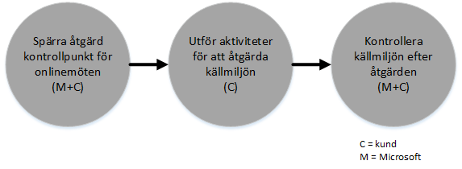

# FastTrack Center-f&#246;rm&#229;nsprocessen f&#246;r Azure Rights Management
Om organisationen är berättigad till FastTrack Center-förmånen för Microsoft Azure Rights Management, kan du arbeta fjärranslutet tillsammans med Microsofts specialister för att förbereda din Azure RMS-miljö. Information om huruvida din organisation är berättigad finns i [FastTrack Center-förmån för Azure Rights Management](../Topic/FastTrack_Center_Benefit_for_Azure_Rights_Management.md).

Den här artikeln innehåller följande:

-   [Overview of the onboarding process](#overview_rms)

-   [Expectations for your source environment](#expectations_src_environ_rms)

-   [Phases of the onboarding process](#phases_onboarding_process_rms)

-   [Microsoft responsibilities](#microsoft_responsibilities_rms) för varje fas

-   [Your responsibilities](#your_responsibilities_rms) för varje fas

Här är vad du kan förvänta dig när onboarding-processen är slutförd:

-   Din Microsoft Azure RMS-klientorganisation har skapats.

-   Licensierade användare har åtkomst till Azure RMS-tjänster med något av följande identitetsalternativ:

    -   Molnidentiteter (unika Microsoft Azure AD-konton).

    -   Synkroniserade identiteter: Microsoft Azure AD-konton synkroniseras från din lokala Active Directory med verktyget Azure Active Directory Connect (Azure AD Connect) för kunder med en enda skog eller flera Active Directory-skogar.

    -   Federerade identiteter – med Microsoft Azure AD-konton som är:

        -   Synkroniserade från Active Directory med Microsoft Azure AD Connect-verktyget för kunder med en enda Active Directory-skogskonfiguration.

        -   Federerade med Active Directory Federation Services (AD FS) 2.0 eller senare från din lokala Active Directory.

## Översikt över onboarding-processen
Onboarding-processen har två huvudkomponenter:

-   **Kärnfunktioner** – uppgifter som krävs för klientkonfiguration och integrering med Azure AD, om så behövs. Kärnfunktionerna omfattar även utgångspunkten för onboarding av andra Microsoft Online-berättigade tjänster.

-   **Tjänst-onboarding** – uppgifter som krävs för att konfigurera fristående Azure RMS eller med Azure AD Connect-katalogsynkronisering eller AD FS.

Följande diagram ger en tidslinje för utnyttjandet av FastTrack Center-förmånen.

Den grundläggande processen ser ut så här:

-   Microsoft kommer att försöka kontakta dig inom 30 dagar från det datum då du köpte en berättigad prenumeration. Du kan också begära hjälp från [FastTrack Center](http://fasttrack.microsoft.com/) om du är redo att distribuera dessa tjänster för din organisation. Om du vill begära hjälp loggar du in på FastTrack Center (http://fasttrack.microsoft.com), går till instrumentpanelen, väljer företagets namn, klickar på fliken med erbjudanden och klickar på knappen för att begära hjälp för berättigad tjänst.

-   Microsoft-teamet hjälper dig med kärnfunktionerna och med att komma igång med varje berättigad tjänst.

Alla onboarding-support kommer att tillhandahållas på distans av utsedd Microsoft-personal:

-   Microsoft kommer att bistå dig med fjärrhjälp avseende olika onboarding-aktiviteter bestående av verktyg, dokumentation och rådgivning. Om du vill att Microsoft ska utföra vissa konfigurationsåtgärder åt dig, kan du välja att ange lämplig åtkomst och behörighet för att Microsoft ska kunna utföra dessa uppgifter.

-   Onboarding-supporten tillhandahålls av FastTrack Center och är tillgänglig under normal kontorstid för respektive region.

-   Onboarding-support är tillgänglig på traditionell kinesiska, engelska, franska, tyska, italienska, japanska, portugisiska (Brasilien) och spanska.

-   Microsoft-teamet kan arbeta direkt med dig eller genom ditt ombud.

## Förväntningar för din källmiljö
Microsoft Active Directory finns kanske redan lokalt i den källmiljö som du vill integrera med Microsoft Azure Active Directory för att kunna utnyttja identitetshantering från en enda konsol. Med FastTrack Center-förmånen kan du integrera Microsoft Azure Active Directory med din befintliga implementering lokalt. Om integrering krävs måste din källmiljö ligga på en miniminivå för programmet.

Följande tabell visar vad som förväntas i din befintliga källmiljö för onboarding.

|Aktivitet|Förväntningar på källmiljön|
|-------------|-------------------------------|
|Kärnfunktioner|Active Directory-skogar med den funktionella skogsnivån inställd på Windows Server 2008 eller senare, med följande skogskonfiguration:  -   En Active Directory-skog -   Flera Active Directory-skogar **Note:** För alla konfigurationer med flera skogar ligger AD FS-distributionen utanför FastTrack Center-förmånen.|
|Tjänst-onboarding  -   Azure RMS|En lokal Active Directory och miljö har förberetts för Azure RMS, som innehåller åtgärder för kända problem som kan förhindra en integrering med Azure AD och Azure RMS-funktioner.|

## Onboarding-processens olika faser
Onboarding i Azure RMS innehåller fem primära steg som visas i följande bild:

-   Initiera

-   Bedöma

-   Åtgärda

-   Aktivera

-   Stäng

Detaljerad information om respektive fas finns i avsnitten [Microsoft responsibilities](#microsoft_responsibilities_rms) och [Your responsibilities](#your_responsibilities_rms).

### Initieringsfasen
När du har köpt ett lämpligt antal licenser följer du anvisningarna i inköpsbekräftelsemeddelandet om hur du kopplar licenserna till din befintliga eller nya klientorganisation. Microsoft kontrollerar om du är behörig till FastTrack Center-förmånen. Microsoft kommer att försöka kontakta dig inom 30 dagar från det datum då du köpte en berättigad prenumeration. Du kan också begära hjälp från [FastTrack Center](http://fasttrack.microsoft.com/) om du är redo att distribuera dessa tjänster för din organisation. Om du vill begära hjälp loggar du in på FastTrack Center (http://fasttrack.microsoft.com), går till instrumentpanelen, väljer företagets namn, klickar på fliken med erbjudanden och klickar på knappen för att begära hjälp för berättigad tjänst.

Under den här fasen diskuterar vi onboarding-processen, verifierar data och konfigurerar ett kick-off möte.

### Bedömningsfasen
När onboarding-processen börjar kommer Microsoft att hjälpa dig med att bedöma din källmiljö och kraven. Verktygen körs för att bedöma din miljö, och Microsoft hjälper dig att bedöma din lokala Active Directory, dina webbläsare, klientoperativsystem, DNS, nätverk, infrastruktur och identitetssystem för att se om några förändringar krävs för onboarding. Baserat på din nuvarande konfiguration tillhandahåller vi en korrigeringsplan för att din källmiljö ska uppfylla minimikraven för en lyckad onboarding till Azure RMS. Vi kommer även att inrätta lämpliga kontrollpunkter för åtgärdsfasen.

### Åtgärdsfasen
Vid behov utför du uppgifterna i åtgärdsplanen på din källmiljö så att du uppfyller onboardingkraven för varje enskild tjänst.

Innan du påbörjar aktiveringsfasen verifierar vi gemensamt åtgärdsaktiviteternas resultat för att se om det är dags att gå vidare.

### Aktiveringsfasen
När alla åtgärdsaktiviteter är slutförda övergår projektet till att konfigurera tjänstanvändningens grundläggande infrastruktur och till att etablera Azure RMS.

**Aktivera fas – kärnfunktioner**

Aktivering av kärnfunktionerna innefattar tjänstetablering och klient- och identitetsintegrering. Den omfattar även steg för att tillhandahålla en grund för onboarding av Microsoft Azure RMS.

Onboarding för Azure RMS kan börja när kärn-onboardingen har slutförts.

**Aktiveringsfas – Azure RMS**

Azure RMS-miljön kan konfigureras med Azure AD Connect-katalogsynkronisering och Active Directory Federation Services (AD FS) efter behov.

För Azure RMS-scenarier som omfattar synkronisering av lokala identiteter till molnet, hjälper vi dig genom att lägga till IT-administratörer och användare i din prenumeration, konfigurera nödvändig hantering, konfigurera Azure RMS, konfigurera katalogsynkronisering med Azure AD Connect och Active Directory Federation Services med Azure AD Connect, konfigurera testanvändare samt verifiera dina kärnanvändningsärenden för tjänsten.

Konfigurationen av Azure RMS omfattar aktivering av följande funktioner:

-   RMS-tjänstaktivering

-   IRM-konfiguration för Exchange Online och Sharepoint Online

-   Rights Management-anslutningstjänst med Exchange lokalt och Sharepoint lokalt

-   RMS-delningsprogram för Windows-enheter och icke-Windows-enheter

## Microsofts ansvar

### Allmänt

-   Tillhandahålla fjärrsupport för de nödvändiga konfigurationsaktiviteter som beskrivs i de detaljerade fasbeskrivningarna.

-   Tillhandahålla tillgänglig dokumentation och programverktyg, administratörskonsoler och skript som hjälper dig att minska eller eliminera konfigurationsåtgärderna.

Det är inte nödvändigt att ge åtkomst och behörighet till Microsoft för att kunna använda FastTrack Center-förmånen. I vissa fall kan du välja att ge Microsoft lämplig åtkomst och behörighet för att utföra särskilda åtgärder för din räkning.

### Initieringsfasen

-   Kontakta dig inom 30 dagar efter inköpet av berättigade licenser för en ny klient.

-   Definiera vilka berättigade tjänster du vill ska omfattas av onboarding-processen.

### Bedömningsfasen

-   Tillhandahålla en administrativ översikt.

-   Ge vägledning om:

    -   DNS-, nätverks- och infrastruktursbehov.

    -   Kundens behov (webbläsare, klientoperativsystem och tjänstebehov).

    -   Användaridentitet och användaretablering.

    -   Identifiering av katalogsynkroniseringskrav.

    -   Aktivera berättigade tjänster som har köpts och definierats som en del av onboarding-processen.

    -   Identifiera krav för pilot- och testmiljö.

-   Fastställa en tidsplan för åtgärdsaktiviteterna.

-   Tillhandahålla en åtgärdschecklista.

### Åtgärdsfasen

-   Hålla konferenssamtal med dig enligt den överenskomna tidsplanen för att granska åtgärdsaktiviteternas genomförande.

-   Bidra med verktyg som identifierar och åtgärdar problem och med att tolka resultaten.

### Aktiveringsfasen
Ge vägledning om:

-   Aktivera din Azure RMS-klientorganisation.

-   Konfigurera brandväggsportar.

-   Konfigurera DNS för berättigade tjänster.

-   Verifiera anslutningen till Azure RMS-tjänster.

-   För enskogsmiljöer:

    -   Installera en katalogsynkronisering mellan dina Active Directory Domain Services (AD DS) och Azure AD Connect, om så behövs.

    -   Konfigurera lösenordssynkronisering med Azure AD Connect-verktyget.

-   För miljöer med flera skogar:

    -   Installera Azure AD Connect-synkronisering, konfigurera för scenarier med flera skogar. Observera att hash-synkronisering och tillbakaskrivning av lösenord stöder flera skogar.  Andra tillbakaskrivningsscenarier stöds dock inte.

    -   Konfigurera synkronisering mellan lokala Active Directory-skogar och Microsoft Azure AD-katalogen (Azure Active Directory).

        > [!NOTE]
        > Utveckling och implementering av anpassade regeltillägg omfattas inte.

-   För en enskild skog när målet är federerade identiteter: Installera och konfigurera Active Directory Federation Services (AD FS) vid behov för lokal domänautentisering med Microsoft Azure AD i en feltolerant konfiguration för en enskild webbplats.

    > [!NOTE]
    > För alla flerskogskonfigurationer ligger AD FS-distributioner utanför omfånget.

-   Testa enkel inloggning (SSO), om den distribuerats

-   Lägga till ytterligare administratörer av informationssäkerhet för att hantera mallar.

-   Koppla ett konto för överordnad användare till Azure RMS.

-   Licensiera två pilotanvändare för Azure RMS.

-   Konfigurera två testdistributionsgrupper för att verifiera principer.

-   Konfigurera en anpassad Azure RMS-mall för din katalog.

-   Ge vägledning om konfigurering av SharePoint Online- och Exchange Online-integrering med Azure RMS, inklusive:

    -   Konfigurera och verifiera Exchange Online-integrering med Azure RMS.

    -   Konfigurera en regel för att testa e-postflödet för kryptering av känsliga meddelanden som skickas till mottagare utanför organisationen.

    -   Konfigurera och verifiera SharePoint Online-skydd av ett testbibliotek som ska skyddas med Azure RMS.

-   Konfigurera en lokal server med RMS-anslutningstjänsten, i förekommande fall:

    -   Konfigurera och verifiera lokal Exchange 2013/2010-integrering med Azure RMS.

    -   Konfigurera en regel för att testa e-postflödet för kryptering av känsliga meddelanden som skickas till mottagare utanför organisationen med anslutningstjänsten.

    -   Konfigurera och verifiera lokalt SharePoint 2013/2010-skydd av ett testbibliotek som ska skyddas med Azure RMS.

-   Konfigurera RMS-delningsprogram för Windows-enheter och icke-Windows-enheter.

## Dina ansvarsområden
I det här avsnittet beskrivs några av dina ansvarsområden under onboarding-processen.

### Allmänt

-   Alla förbättringar och integreringar avseende din Azure RMS-klientorganisation, utöver de konfigurerbara alternativ som beskrivs i den här artikeln.

-   Övergripande program- och projekthantering av dina resurser.

-   Slutanvändarkommunikation, dokumentation, utbildning och ändringshantering.

-   Supportdokumentation och utbildning.

-   Produktion av eventuella rapporter, presentationer eller mötesanteckningar som är specifika för din organisation.

-   Produktion av arkitektur- eller teknikdokumentation som är specifik för din organisation.

-   Utformning, införskaffande, installation och konfiguration av maskinvara och nätverk.

-   Upphandling, installation och konfiguration av program.

-   Hantera, konfigurera och tillämpa säkerhetsprinciper utöver de som används för att testa Azure RMS-tjänsternas grundläggande konfiguration och funktioner.

-   Registrera användarkonton, förutom de som används för att testa Azure RMS-tjänsternas grundläggande konfiguration och funktioner.

-   Nätverkskonfiguration, analys, bandbreddsverifiering, testning och övervakning.

-   Hantera godkännandeprocessen för teknisk ändringshantering och skapa stöddokumentation.

-   Ändra din driftmodell och dina driftriktlinjer.

-   Avställning och borttagning av källmiljöer och tjänster som redan används av kunden.

-   Konstruera och underhålla din testmiljö.

-   Installera service pack och andra nödvändiga uppdateringar på infrastrukturservrar.

-   Tillhandahålla och konfigurera alla offentliga SSL-certifikat.

-   Skriva organisationens användningsvillkor som ska konfigureras och visas på de enheter som ägs av slutanvändarna.

### Initieringsfasen

-   Arbeta med Microsoft-teamet för att inleda onboarding av berättigade tjänster.

-   Delta i kick-off-mötet, hantera och leda deltagare från din organisation och bekräfta tidslinjen för åtgärder.

### Bedömningsfasen

-   Identifiera lämpliga intressenter (inklusive en projektledare) för att slutföra de nödvändiga bedömningsaktiviteterna.

-   Du kan välja att dela din skärm med Microsoft om du behöver vägledning när du kör utvärderingsverktygen mot din miljö eller Azure RMS-prenumerationen.

-   Delta i mötena för att skapa en åtgärdschecklista och bidra till den övergripande planen om bl.a. infrastruktur, nätverk, administration, katalogsynkroniseringsförberedelser, nätverkssäkerhet och frågor om federerad identitet.

-   Delta i mötena för att lägga upp strategin för användaretablering.

-   Delta i mötena för att planera konfigurationen av onlinetjänster.

-   Skapa en supportplan för migreringsberedskap.

### Åtgärdsfasen

-   Genomföra de nödvändiga stegen för att slutföra de åtgärdsaktiviteter som har identifierats i bedömningsfasen.

-   Delta i kontrollpunktsmöten.

### Aktiveringsfasen

-   Du kan välja att dela din skärm med Microsoft om du behöver vägledning när du gör ändringar i din miljö eller i Azure RMS-prenumerationen.

-   Hantera resurser på lämpligt sätt.

-   Konfigurera nätverksrelaterade objekt enligt vägledning från Microsoft.

-   Genomföra katalogberedskap och konfigurera katalogsynkronisering enligt vägledning från Microsoft.

-   Konfigurera den säkerhetsrelaterade infrastrukturen (t.ex. brandväggsportar) enligt vägledning från Microsoft.

-   Implementera lämplig klientinfrastruktur.

-   Implementera en slutanvändarstrategi enligt vägledning från Microsoft.

-   Aktivera olika tjänster enligt vägledning från Microsoft.

## Vill du ha mer information?
Se [Microsoft Azure Rights Management](http://products.office.com/business/microsoft-azure-rights-management) och [Enterprise Mobility Suite](http://www.microsoft.com/en-us/server-cloud/products/enterprise-mobility-suite/default.aspx).

