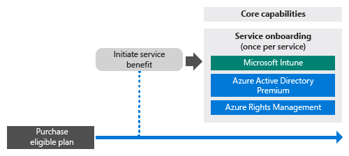
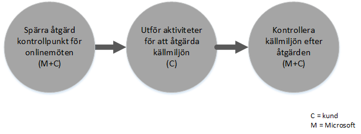

# FastTrack Center-f&#246;rm&#229;n f&#246;r Intune
Om din organisation är berättigad för Microsoft Intune-tjänsteförmånerna kan du arbeta fjärranslutet med Microsofts specialister för att göra din Microsoft Intune-miljö redo för användning.

Microsoft Intune är en del av Microsofts Enterprise Mobility Suite (EMS), som ger funktioner för Enterprise Mobility Management (EMM), inklusive Hantering av mobila enheter (MDM) och Hantering av mobilprogram (MAM).  Du kan använda Microsoft Intune för att göra det möjligt för medarbetarna att vara produktiva på mobila enheter genom att etablera enheter, konfigurera enheter och distribuera mobilappar.  Du kan även använda Microsoft Intune för att hjälpa till att skydda företagsdata genom att övervaka enheternas kompatibilitet, skydda mobilprogram och data, samt integrera med Azure AD för att styra åtkomst till företagstjänster.

Information om huruvida din organisation är berättigad finns i [FastTrack Center-förmån för Intune](../Topic/FastTrack_Center_Benefit_for_Intune.md). Om du är intresserad av att förbereda din miljö för andra tjänster i Enterprise Mobility Suite kan du se [FastTrack Center-förmån för Enterprise Mobility Suite](../Topic/FastTrack_Center_Benefit_for_Enterprise_Mobility_Suite.md).

**Letar du efter information om Microsoft FastTrack för Office 365? Se** [FastTrack Center-förmån för Office 365](https://technet.microsoft.com/library/office-365-onboarding-benefit.aspx).

Den här artikeln innehåller följande information om tjänsteförmånerna för Microsoft Intune:

-   [Overview of the onboarding process](#overview_onboarding_process)

-   [Expectations for your source environment](#expectations_src_environ)

-   [Phases of the onboarding process](#phases_onboarding_process)

-   [Microsoft responsibilities](#microsoft_responsibilities) för varje fas

-   [Your responsibilities](#your_responsibilities) för varje fas

Här är vad du kan förvänta dig när onboarding-processen är slutförd:

-   Din Microsoft Online Service-klient skapas.

-   Licensierade användare kan komma åt Microsoft Intune-tjänsten med något av följande identitetsalternativ:

    -   Molnidentiteter (unika Microsoft Online-tjänstkonton).

    -   Synkroniserade identiteter: Microsoft Intune-konton synkroniseras från en lokal Active Directory med Azure Active Directory Connect (synkroniseringstjänster):

        -   För kunder med en enda Active Directory-skogsmiljö.

        -   För kunder med stöd för Active Directory-topologi med flera skogar.

-   Federerade identiteter –Microsoft Intune-konton:

    -   Synkroniseras från Active Directory med verktyget Microsoft Azure Active Directory Connect för kunder med en enda Active Directory-skogskonfiguration, eller för kunder med en enda Active Directory-kontoskog (även kallat ”inloggningsskog”) och en enda skogskonfiguration för Active Directory-resursen.

    -   Federeras med Windows Server 2012 R2 Active Directory Federation Services-rollen från din lokala Active Directory, eller federeras med Active Directory Federation Services (AD FS) 2.0 eller senare från din lokala Active Directory.

## Översikt över onboarding-processen
Onboarding-processen har två huvudkomponenter:

-   **Kärnfunktioner** – uppgifter som krävs för klientkonfiguration och integrering med Azure AD, om så behövs. Kärnfunktionskomponenterna tillhandahåller även utgångspunkten för onboarding av andra berättigade tjänster.

-   **Tjänst-onboarding** - uppgifter som krävs för att konfigurera Microsoft Intune.

Följande diagram visar en händelsesekvens för utnyttjandet av FastTrack Center-förmånen.

Den grundläggande processen ser ut så här:

-   FastTrack Center kommer att försöka kontakta dig inom 30 dagar från det datum då du köpte en berättigad prenumeration. Du kan också begära hjälp från [FastTrack Center](http://fasttrack.microsoft.com/) om du är redo att distribuera dessa tjänster för din organisation. Om du vill begära hjälp loggar du in på [FastTrack Center](http://fasttrack.microsoft.com/), går till instrumentpanelen, väljer företagets namn, klickar på fliken med erbjudanden och klickar på knappen Be om hjälp för att begära hjälp för Microsoft Intune, Azure Active Directory Premium eller Azure Rights Management Premium.

-   FastTrack Center hjälper dig med kärnfunktionerna och med att komma igång med varje berättigad tjänst.

Alla onboarding-support kommer att tillhandahållas på distans av utsedd Microsoft-personal:

-   Microsoft kommer att bistå dig med fjärrhjälp avseende olika onboarding-aktiviteter bestående av verktyg, dokumentation och rådgivning.

-   Onboarding-supporten tillhandahålls av FastTrack Center och är tillgänglig under normal kontorstid för respektive region.

-   Onboarding-support är tillgänglig på traditionell kinesiska, engelska, franska, tyska, italienska, japanska, portugisiska (Brasilien) och spanska.

-   Microsoft-teamet kan arbeta direkt med dig eller genom ditt ombud.

## Förväntningar för din källmiljö
Du har kanske redan tjänster i din källmiljö som du vill flytta till eller integrera med dina Microsoft Intune-tjänster. För vissa tjänster inkluderar FastTrack Center-förmånerna hjälp med att konfigurera en viss integreringsnivå för din källmiljö. Om integrering krävs måste din källmiljö ligga på en miniminivå för programmet.

Följande tabell visar vad som förväntas i din befintliga källmiljö för onboarding.

|Aktivitet|Förväntningar på källmiljön|
|-------------|-------------------------------|
|Kärnfunktioner|Active Directory-skogar med den funktionella skogsnivån inställd på Windows Server 2008 eller senare, med följande skogskonfiguration:  -   En Active Directory-skog -   Flera Active Directory-skogar **Note:** För alla konfigurationer med flera skogar ligger AD FS-distributionen utanför FastTrack Center-förmånen.|
|Tjänst-onboarding  -   Microsoft Intune -   Microsoft Intune integrerat med System Center Configuration Manager|För enhetshantering med System Center Configuration Manager 2012 R2 eller senare ansluten med Microsoft Intune måste IT-administratörerna följa [Checklista för administratörer: Konfigurera Configuration Manager för att hantera mobila enheter med Microsoft Intune](https://technet.microsoft.com/library/jj943763.aspx). **Note:** Tjänsteförmånerna omfattar inte stöd för att konfigurera eller uppgradera System Center Configuration Manager till de minimikrav som behövs för Microsoft Intune integrerat med System Center Configuration Manager.|

## Onboarding-processens olika faser
Onboarding omfattar fyra huvudsakliga faser:

-   Initiera

-   Bedöma

-   Åtgärda

-   Aktivera

Detaljerad information om respektive fas finns i avsnitten [Microsoft responsibilities](#microsoft_responsibilities) och [Your responsibilities](#your_responsibilities).

### Initieringsfasen
När du har köpt ett lämpligt antal och typer av licenser följer du anvisningarna i inköpsbekräftelsemeddelandet om hur du associerar licenserna till din befintliga eller nya klient. FastTrack Center kontrollerar om du är behörig till tjänsteförmånen. Microsoft kommer att försöka kontakta dig inom 30 dagar från det datum då du köpte en berättigad prenumeration. Du kan också begära hjälp från [FastTrack Center](http://fasttrack.microsoft.com/) om du är redo att distribuera dessa tjänster för din organisation. Om du vill begära hjälp loggar du in på [FastTrack Center](http://fasttrack.microsoft.com/), går till instrumentpanelen, väljer företagets namn, klickar på fliken med erbjudanden och klickar på knappen Be om hjälp för att begära hjälp för Microsoft Intune, Azure Active Directory Premium eller Azure Rights Management Premium.

Under den här fasen diskuterar vi onboarding-processen, verifierar data och konfigurerar ett kick-off möte.

### Bedömningsfasen
När onboarding-processen börjar kommer Microsoft att hjälpa dig med att bedöma din källmiljö och kraven. Verktygen körs för att bedöma din miljö, och Microsoft hjälper dig att bedöma dina webbläsare, klientoperativsystem, DNS, nätverk, infrastruktur och identitetssystem för att se om några förändringar krävs för onboarding. Baserat på din nuvarande konfiguration tillhandahåller vi en korrigeringsplan som kommer att få din källmiljö att uppfylla minimikraven för lyckad introduktion till Microsoft Intune. Vi kommer även att inrätta lämpliga kontrollpunkter för åtgärdsfasen.

### Åtgärdsfasen
Vid behov utför du uppgifterna i åtgärdsplanen på din källmiljö så att du uppfyller onboardingkraven för varje enskild tjänst.

Innan du påbörjar aktiveringsfasen verifierar vi gemensamt åtgärdsaktiviteternas resultat för att se om det är dags att gå vidare.

### Aktiveringsfasen
När alla åtgärdsaktiviteter är slutförda övergår projektet till att konfigurera tjänstanvändningens grundläggande infrastruktur och till att etablera Microsoft Intune.

**Aktivera fas – kärnfunktioner**

Aktivering av kärnfunktionerna innefattar tjänstetablering och klient- och identitetsintegrering. Den inkluderar även steg för att tillhandahålla en grund för onboarding av Microsoft Intune.

Onboarding för Microsoft Intune kan börja när aktiveringen av kärnfunktionerna har slutförts.

**Aktiveringsfasen - Microsoft Intune**

För Microsoft Intune och baserat på hanteringsbehoven för den mobila enheten och mobilprogram, hjälper vi dig igenom processen för att komma igång med att använda Microsoft Intune till att hantera enheter. Vilka de specifika stegen blir beror på din källmiljö. Det kan handla om att:

-   Licensiera dina slutanvändare. När så behövs tillhandahåller vi även hjälp om hur du aktiverar volymlicenser för Microsoft-molntjänstklienten.

-   Konfigurera identiteter som ska användas av Microsoft Intune genom att använda antingen lokala Active Directory- eller molnidentiteter.

-   Lägga till användare i Microsoft Intune-prenumerationen, definiera IT-administratörsroller och skapa användar- och enhetsgrupper.

-   Konfigurera behörighet för hantering av mobila enheter baserat på hanteringsbehoven:

    -   Ange Microsoft Intune som MDM-utfärdare när Microsoft Intune är den enda MDM-lösningen eller används tillsammans med Hantering av mobila enheter för Office 365.

    -   Om du har en befintlig implementering av System Center Configuration Manager och vill utöka dess hanteringsmöjligheter med Microsoft Intune anger du Configuration Manager som MDM-utfärdare.

        > [!NOTE]
        > Om du bara behöver använda Hantering av mobilprogram för slutanvändarnas egna enheter, delade enheter eller enheter av kiosktyp är det inte nödvändigt att ange en MDM-utfärdare.

-   Om hantering av mobila enheter finns i omfattningen tillhandahåller vi vägledning för:

    -   Konfiguration av testgrupper som ska användas för att verifiera MDM-hanteringsprinciper.

    -   Konfiguration av MDM-hanteringsprinciper och tjänster som:

        -   Programdistribution för varje plattform som stöds genom webb- eller djuplänkar.

        -   Villkorliga åtkomstprinciper.

        -   Distribution av e-postprofiler.

        -   Konfiguration av Microsoft Exchange Intune Connector, i tillämpliga fall.

    -   Registrering av upp till två testenheter för vardera [plattform som stöds](https://technet.microsoft.com/library/dn600287.aspx) till Microsoft Intune eller Configuration Manager med Microsoft Intune-tjänsten.

    -   Använda inventarierapporter för program- och maskinvara.

-   Om Hantering av mobilprogram (MAM) finns i omfattningen, eller om du vill komplettera en befintlig MDM-lösning från Microsoft eller tredje part med MAM-principer tillhandahåller vi vägledning för:

    -   Konfiguration av MAM-principer för varje plattform som stöds.

    -   Konfiguration av villkorliga åtkomstprinciper för hanterade appar.

    -   Inriktning av lämpliga användargrupper med ovanstående MAM-principer.

    -   Användning av användningsrapporter för hanterade program.

-   Om datorhantering finns i omfattningen tillhandahåller vi vägledning för:

    -   Installation av Intune-klientprogramvaran, vid behov.

    -   Användning av programvaru- och maskinvarurapporter i Intune.

## Microsofts ansvar
I det här avsnittet beskrivs några av Microsofts ansvarsområden under onboarding-processen.

### Allmänt

-   Tillhandahålla fjärrsupport för de nödvändiga konfigurationsaktiviteter som beskrivs i de detaljerade fasbeskrivningarna.

-   Tillhandahålla tillgänglig dokumentation och programverktyg, administratörskonsoler och skript som hjälper dig att minska eller eliminera konfigurationsåtgärderna.

### Initieringsfasen

-   Kontakta dig inom 30 dagar efter inköpet av berättigade licenser för en ny klient.

-   Arbeta med dig för att påbörja onboarding.

-   Definiera vilka berättigade tjänster du vill ska omfattas av onboarding-processen.

### Bedömningsfasen

-   Tillhandahålla en administrativ översikt.

-   Ge vägledning om:

    -   DNS-, nätverks- och infrastruktursbehov.

    -   Kundens behov (webbläsare, klientoperativsystem och tjänstebehov).

    -   Användaridentitet och användaretablering.

    -   Aktivera berättigade tjänster som har köpts och definierats som en del av onboarding-processen.

-   Fastställa en tidsplan för åtgärdsaktiviteterna.

-   Tillhandahålla en åtgärdschecklista.

### Åtgärdsfasen

-   Hålla konferenssamtal med dig enligt den överenskomna tidsplanen för att granska åtgärdsaktiviteternas genomförande.

-   Bidra med verktyg som identifierar och åtgärdar problem och med att tolka resultaten.

### Aktiveringsfasen
Ge vägledning om:

-   Aktivera din Microsoft Online-tjänstklient.

-   Konfigurera TCP/IP-protokoll och brandväggsportar.

-   Konfigurera DNS för berättigade tjänster.

-   Verifiera anslutning till Microsofts onlinetjänster.

-   För enskogsmiljöer:

    -   Installera en katalogsynkroniseringsserver mellan dina Active Directory Domain Services (AD DS) och berättigade Microsoft Online-tjänster, om så behövs.

    -   Konfigurera lösenordssynkronisering (lösenordshash) till Microsoft Intune (Azure Active Directory) med Azure Active Directory Connect-verktyget.

        > [!NOTE]
        > Utveckling och implementering av anpassade regeltillägg omfattas inte.

-   För en enskild skog när målet är federerade identiteter: Vid behov installera och konfigurera Active Directory Federation Services (AD FS) för lokal domänautentisering med Microsoft Intune i en feltolerant konfiguration för en enskild webbplats.

    > [!NOTE]
    > För alla flerskogskonfigurationer ligger AD FS-distributioner utanför omfånget.

-   Testa enkel inloggning (SSO) om den distribuerats

#### Aktiveringsfasen – Microsoft Intune
Ge vägledning om:

-   Licensiera dina slutanvändare. När så behövs tillhandahåller vi även hjälp om hur du aktiverar volymlicenser för Microsoft-molntjänstklienten.

-   Konfigurera identiteter som ska användas av Microsoft Intune genom att använda antingen lokala Active Directory- eller molnidentiteter.

-   Lägga till användare i Microsoft Intune-prenumerationen, definiera IT-administratörsroller och skapa användar- och enhetsgrupper.

-   Konfigurera behörighet för hantering av mobila enheter baserat på hanteringsbehoven:

    -   Ange Microsoft Intune som MDM-utfärdare när Microsoft Intune är den enda MDM-lösningen eller används tillsammans med Hantering av mobila enheter för Office 365.

    -   Om du har en befintlig implementering av System Center Configuration Manager och vill utöka dess hanteringsmöjligheter med Microsoft Intune anger du Configuration Manager som MDM-utfärdare.

        > [!NOTE]
        > Om du bara behöver använda Hantering av mobilprogram för slutanvändarnas egna enheter, delade enheter eller enheter av kiosktyp är det inte nödvändigt att ange en MDM-utfärdare.

-   Om hantering av mobila enheter finns i omfattningen tillhandahåller vi vägledning för:

    -   Konfiguration av testgrupper som ska användas för att verifiera MDM-hanteringsprinciper.

    -   Konfiguration av MDM-hanteringsprinciper och tjänster som:

        -   Programdistribution för varje plattform som stöds genom webb- eller djuplänkar.

        -   Villkorliga åtkomstprinciper.

        -   Distribution av e-postprofiler.

        -   Konfiguration av Microsoft Exchange Intune Connector, i tillämpliga fall.

    -   Registrering av upp till två testenheter för vardera plattform som stöds till Microsoft Intune eller Configuration Manager med Microsoft Intune-tjänsten.

    -   Använda inventarierapporter för maskin- och programvara.

-   Om Hantering av mobilprogram (MAM) finns i omfattningen, eller om du vill komplettera en befintlig MDM-lösning från tredje part med MAM-principer tillhandahåller vi vägledning för:

    -   Konfiguration av MAM-principer för varje plattform som stöds.

    -   Konfiguration av villkorliga åtkomstprinciper för hanterade appar.

    -   Inriktning av lämpliga användargrupper med ovanstående MAM-principer.

    -   Användning av användningsrapporter för hanterade program.

-   Om datorhantering finns i omfattningen tillhandahåller vi vägledning för:

    -   Installation av Intune-klientprogramvaran, vid behov.

    -   Användning av programvaru- och maskinvarurapporter i Intune.

## Dina ansvarsområden
I det här avsnittet beskrivs några av dina ansvarsområden under onboarding-processen.

### Allmänt

-   Alla eventuella förbättringar och integreringar avseende din Microsoft Online Service-klient utöver de konfigurerbara alternativ som listas i den här artikeln.

-   Övergripande program- och projekthantering av dina resurser.

-   Slutanvändarkommunikation, dokumentation, utbildning och ändringshantering.

-   Supportdokumentation och utbildning.

-   Produktion av eventuella rapporter, presentationer eller mötesanteckningar som är specifika för din organisation.

-   Produktion av arkitektur- eller teknikdokumentation som är specifik för din organisation.

-   Utformning, införskaffande, installation och konfiguration av maskinvara och nätverk.

-   Upphandling, installation och konfiguration av program.

-   Konfiguration, förpackning och distribution av de klientprogram som krävs för Microsoft Intune.

-   Aktivering av mobila enheter.

-   Nätverkskonfiguration, analys, bandbreddsverifiering, testning och övervakning.

-   Hantera godkännandeprocessen för teknisk ändringshantering och skapa stöddokumentation.

-   Ange och definiera grupprinciper för användar-, arbetsstations- och serverhantering.

-   Ändra din driftmodell och dina driftriktlinjer.

-   Konfigurera Multi-Factor Authentication.

-   Nedläggning och borttagning av källmiljöer (som andra dator- eller enhetshanteringslösningar).

-   Konstruera och underhålla din testmiljö.

-   Installera service pack och andra nödvändiga uppdateringar på infrastrukturservrar.

-   Tillhandahålla och konfigurera alla offentliga SSL-certifikat.

-   Skriva organisationens användningsvillkor som ska konfigureras och visas på de Microsoft Intune-företagsportaler som är tillgängliga för slutanvändarna.

### Initieringsfasen

-   Arbeta med Microsoft-teamet för att inleda onboarding av berättigade tjänster.

-   Delta i kick-off-mötet, hantera och leda deltagare från din organisation och bekräfta tidslinjen för åtgärder.

### Bedömningsfasen

-   Identifiera lämpliga intressenter (inklusive en projektledare) för att slutföra de nödvändiga bedömningsaktiviteterna.

-   Du kan välja att dela din skärm med Microsoft om du behöver vägledning när du kör utvärderingsverktygen mot din miljö eller din Microsoft Intune-prenumeration.

-   Delta i mötena för att skapa en åtgärdschecklista och bidra till den övergripande planen om bl.a. infrastruktur, nätverk, administration, katalogsynkroniseringsförberedelser, nätverkssäkerhet och frågor om federerad identitet.

-   Delta i mötena för att lägga upp strategin för användaretablering.

-   Delta i mötena för att planera konfigurationen av onlinetjänster.

-   Skapa en supportplan för migreringsberedskap.

### Åtgärdsfasen

-   Genomföra de nödvändiga stegen för att slutföra de åtgärdsaktiviteter som har identifierats i bedömningsfasen.

-   Delta i kontrollpunktsmöten.

### Aktiveringsfasen

-   Du kan välja att dela din skärm med Microsoft om du behöver vägledning när du gör ändringar i din miljö eller din prenumeration på Microsoft Online-tjänster.

-   Hantera resurser på lämpligt sätt.

-   Konfigurera nätverksrelaterade objekt enligt vägledning från Microsoft.

-   Genomföra katalogberedskap och konfigurera katalogsynkronisering enligt vägledning från Microsoft.

-   Konfigurera den säkerhetsrelaterade infrastrukturen (t.ex. brandväggsportar) enligt vägledning från Microsoft.

-   Implementera lämplig klientinfrastruktur.

-   Implementera en slutanvändarstrategi enligt vägledning från Microsoft.

-   Aktivera olika tjänster enligt vägledning från Microsoft.

-   Samarbeta med Microsoft för att slutföra onboarding för alla berättigade tjänster inom 12 månader från det att onboarding-processen påbörjades.

-   Vid aktivering av dator- eller mobilenhetshantering med Microsoft Intune så använd testenheter när du aktiverar hanteringsprinciper via Microsofts Intune. Om testenheter inte är tillgängliga är kunderna ansvariga för att säkerhetskopiera och att, vid behov, återställa innehållet från de enheter som används under Microsoft Intune-aktiveringsfasen.

-   Välja upp till två program för varje Microsoft Intune-plattform som stöds och som kan distribueras genom webb- eller djuplänkar.

-   Hantera, konfigurera och tillämpa säkerhetsprinciper utöver de som används för att testa de grundläggande Microsoft Intune-tjänsternas konfiguration och funktioner.

## Vill du ha mer information?
Se [Microsoft Intune](http://www.microsoft.com/en-us/server-cloud/products/microsoft-intune/default.aspx) och [Enterprise Mobility Suite](http://www.microsoft.com/en-us/server-cloud/products/enterprise-mobility-suite/default.aspx).

